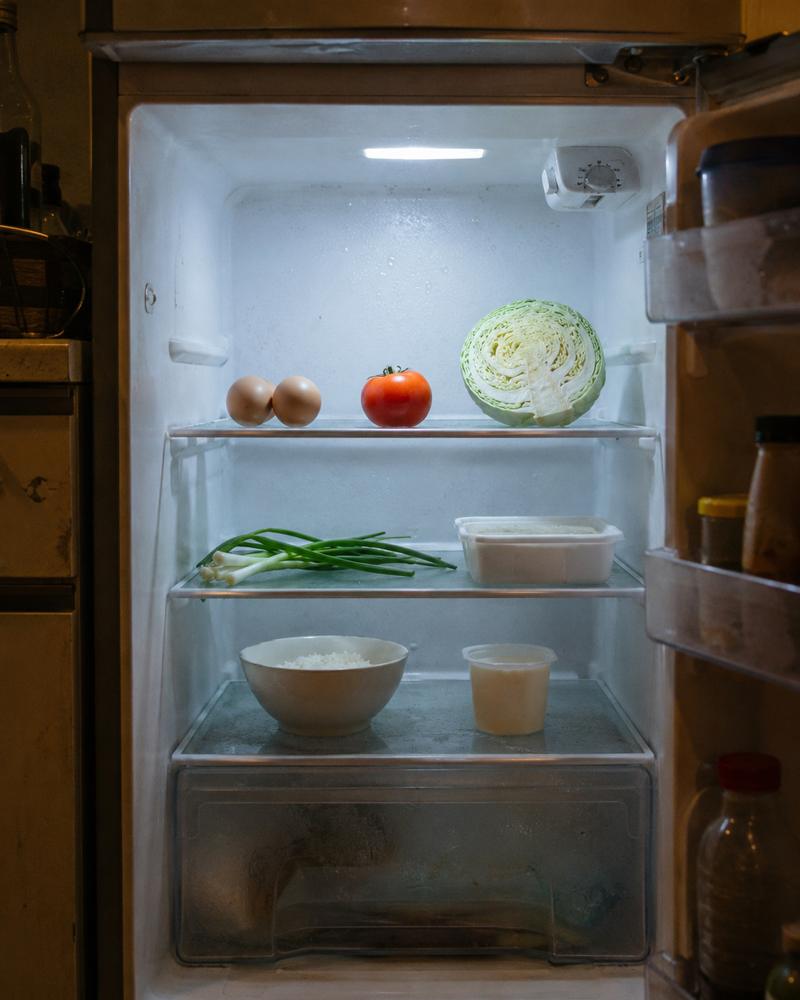

<div align="center">

# 🧊 懒人餐 Agent

**拍一张冰箱照片，让 AI 帮你认食材、清库存、决定今晚吃什么。**

面向一人食与出租屋场景的 AI 食材管理应用。识别现有食材后，生成简单、可执行的一人份菜谱，并同步管理库存、保质提醒与购物清单。

[](https://nextjs.org/)
[](https://react.dev/)
[](https://www.typescriptlang.org/)
[](https://www.deepseek.com/)
[](#使用说明)

</div>



## 为什么做这个项目

很多人不是不会做饭，而是不知道冰箱里有什么、哪些食材应该先吃，以及现有食材到底能做什么。

懒人餐 Agent 把这几个步骤合成一次操作：

1. 拍摄或上传冰箱、食材照片。
2. AI 识别可见食材、数量与状态。
3. 按日常、减脂或增肌目标推荐 3 道一人餐。
4. 保存食材到库存，提醒优先消耗。
5. 根据库存与菜谱缺口生成购物清单。

## 核心功能

| 功能 | 说明 |
|---|---|
| 📷 AI 食材识别 | 识别照片中的食材、数量、类别、可见状态与置信度 |
| 🍳 一人餐推荐 | 推荐 3 道出租屋也能完成的简单菜，并给出步骤与预计耗时 |
| 🎯 饮食目标 | 支持日常、减脂、增肌三种推荐偏好 |
| 🥗 营养估算 | 展示一人份热量、蛋白质和用油量，客户端会基于食材克数再次估算 |
| 🧺 库存管理 | 保存识别结果、手动补录、标记吃完或丢弃，并优先展示临期食材 |
| 🛒 购物清单 | 根据低库存与菜谱缺失食材自动生成清单，也支持手动添加 |
| 📊 节省统计 | 记录做饭次数、挽救食材数量和估算节省金额 |
| 👤 账户与数据 | Sites 版支持 ChatGPT 登录、匿名数据合并、数据导出与删除 |
| 💬 反馈与后台 | Sites 版包含反馈入口和管理员数据概览 |

> 食材状态、保质时间和营养数据均为辅助估算，不能替代包装日期、嗅觉检查或专业营养建议。发现异味、发黏、霉变或包装异常时请勿食用。

## 技术栈

- 前端：Next.js 16、React 19、TypeScript、Tailwind CSS 4
- UI：Radix / shadcn 风格组件、Lucide Icons、Sonner
- AI：DeepSeek 兼容的视觉对话接口
- Sites 数据：Cloudflare D1 + Drizzle ORM
- Netlify 数据：Netlify Blobs
- 构建：Vinext / Vite

## 两种部署模式

仓库保留了两套后端实现。部署前请先选择一种，不要把两套数据源混用。

| | OpenAI Sites / Cloudflare | Netlify |
|---|---|---|
| 前端入口 | `app/` | `netlify/` |
| API | `app/api/` | `netlify/functions/api.mts` |
| 数据存储 | Cloudflare D1 | Netlify Blobs |
| 身份系统 | Sign in with ChatGPT，也支持匿名设备 | 自建用户名、密码与 Session |
| 数据能力 | 账户、导出、删除、后台统计 | 库存、清单、统计与反馈 |
| 适合场景 | 完整产品版本 | 独立备用站或快速演示 |

## 本地运行

### 环境要求

- Node.js `>= 22.13.0`
- npm
- Linux 环境用于完整执行仓库内的构建辅助脚本

### 1. 安装依赖

```bash
npm ci
```

### 2. 配置环境变量

在部署平台或本地运行环境中配置：

```bash
DEEPSEEK_API_KEY=your_api_key
```

也可以使用兼容变量名 `VISION_API_KEY`。不要把真实密钥提交到 Git 仓库。

| 变量 | 必需 | 默认值 | 用途 |
|---|---:|---|---|
| `DEEPSEEK_API_KEY` | 是* | — | DeepSeek API 密钥 |
| `VISION_API_KEY` | 是* | — | `DEEPSEEK_API_KEY` 的兼容替代项 |
| `VISION_API_BASE_URL` | 否 | `https://api.deepseek.com` | 兼容视觉接口地址 |
| `VISION_MODEL` | 否 | `deepseek-v4-flash-vision-exp` | 视觉模型名称 |
| `RATE_LIMIT_SALT` | Sites 生产环境建议 | 内置开发回退值 | 客户端指纹散列盐 |
| `ADMIN_EMAIL` | 否 | — | Sites 版管理员邮箱 |

\* `DEEPSEEK_API_KEY` 与 `VISION_API_KEY` 配置其中一个即可。

### 3. 启动开发服务器

```bash
npm run dev
```

## 构建与检查

```bash
# Sites / Cloudflare 版本
npm run build

# Netlify 版本
npm run build:netlify

# ESLint
npm run lint

# 构建并执行测试
npm test
```

## 部署

### Netlify

1. 在 Netlify 中导入此 GitHub 仓库。
2. 配置 `DEEPSEEK_API_KEY` 或 `VISION_API_KEY`。
3. 直接部署；构建命令、发布目录和 Functions 目录已写入 `netlify.toml`。

```text
Build command: npm run build:netlify
Publish directory: dist-netlify
Functions directory: netlify/functions
```

Netlify 版会通过 Netlify Blobs 保存账号、Session、库存与购物清单数据。

### OpenAI Sites / Cloudflare

- `.openai/hosting.json` 声明了名为 `DB` 的 D1 绑定。
- 数据表结构位于 `db/schema.ts`，迁移文件位于 `drizzle/`。
- `app/chatgpt-auth.ts` 封装了 Sign in with ChatGPT 的登录辅助方法。
- 管理后台位于 `/admin`，需要配置 `ADMIN_EMAIL`。

## 项目结构

```text
.
├── app/                    # Sites 页面、API、账户与后台
├── components/ui/          # 通用 UI 组件
├── db/                     # D1 / Drizzle 数据访问与表结构
├── drizzle/                # 数据库迁移文件
├── lib/                    # 库存、营养、用户与事件工具
├── netlify/                # Netlify 前端入口与 Functions 后端
├── public/                 # 静态资源
├── scripts/                # 安装、构建与环境辅助脚本
├── tests/                  # 页面与 UI 自动化检查
├── worker/                 # Cloudflare Worker 入口
├── netlify.toml            # Netlify 部署配置
└── vite.config.ts          # Sites / Vinext 构建配置
```

## API 概览

| 路径 | 能力 |
|---|---|
| `/api/analyze` | 模型状态、图片识别与菜谱生成 |
| `/api/inventory` | 库存查询、保存与状态更新 |
| `/api/shopping` | 购物清单查询、生成与更新 |
| `/api/stats` | 做饭与节省统计 |
| `/api/feedback` | 用户反馈 |
| `/api/account` | Sites 版账户数据合并、导出与删除 |
| `/api/events` | Sites 版产品事件记录 |

## 当前注意事项

- 两套后端的认证、限额和账户功能并不完全一致，功能变更需要同步维护。
- AI 输出属于不可信边界，正式上线前应继续加强结构校验、长度限制与异常值处理。
- 公开服务应增加图片请求体限制、登录防爆破策略和更严格的接口限流。
- Netlify Blobs 版本以整份 JSON 保存用户状态，高并发写入时需要额外处理覆盖风险。

## 使用说明

本仓库当前未提供独立的开源许可证。公开可见不等于自动授予复制、修改或再分发权；如需开源协作，请先补充合适的 `LICENSE` 文件。

---

<div align="center">

**少点一次外卖，先把冰箱里的菜救回来。**

</div>
